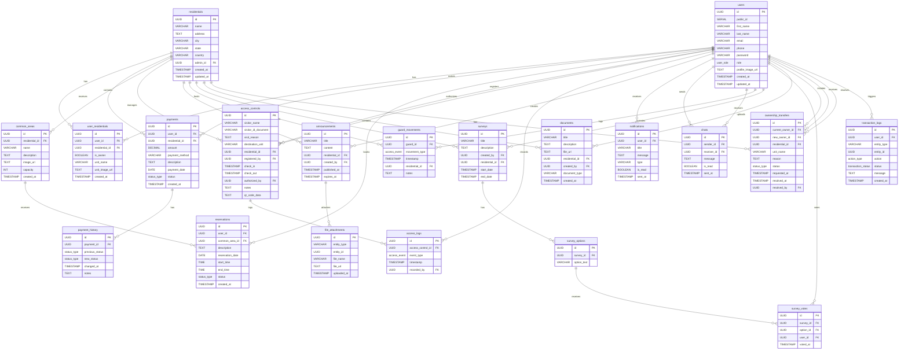

# Resicue Database
### PostgreSQL

```mermaid
erDiagram

users {
  UUID id PK
  SERIAL public_id
  VARCHAR first_name
  VARCHAR last_name
  VARCHAR email
  VARCHAR phone
  VARCHAR password
  user_role role
  TEXT profile_image_url
  TIMESTAMP created_at
  TIMESTAMP updated_at
}

residentials {
  UUID id PK
  VARCHAR name
  TEXT address
  VARCHAR city
  VARCHAR state
  VARCHAR country
  UUID admin_id FK
  TIMESTAMP created_at
  TIMESTAMP updated_at
}

user_residentials {
  UUID id PK
  UUID user_id FK
  UUID residential_id FK
  BOOLEAN is_owner
  VARCHAR unit_name
  TEXT unit_image_url
  TIMESTAMP created_at
}

common_areas {
  UUID id PK
  UUID residential_id FK
  VARCHAR name
  TEXT description
  TEXT image_url
  INT capacity
  TIMESTAMP created_at
}

reservations {
  UUID id PK
  UUID user_id FK
  UUID common_area_id FK
  TEXT description
  DATE reservation_date
  TIME start_time
  TIME end_time
  status_type status
  TIMESTAMP created_at
}

payments {
  UUID id PK
  UUID user_id FK
  UUID residential_id FK
  DECIMAL amount
  VARCHAR payment_method
  TEXT description
  DATE payment_date
  status_type status
  TIMESTAMP created_at
}

payment_history {
  UUID id PK
  UUID payment_id FK
  status_type previous_status
  status_type new_status
  TIMESTAMP changed_at
  TEXT notes
}

access_controls {
  UUID id PK
  VARCHAR visitor_name
  VARCHAR visitor_id_document
  TEXT visit_reason
  VARCHAR destination_unit
  UUID residential_id FK
  UUID registered_by FK
  TIMESTAMP check_in
  TIMESTAMP check_out
  UUID authorized_by FK
  TEXT notes
  TEXT qr_code_data
}

access_logs {
  UUID id PK
  UUID access_control_id FK
  access_event event_type
  TIMESTAMP timestamp
  UUID recorded_by FK
}

announcements {
  UUID id PK
  VARCHAR title
  TEXT content
  UUID residential_id FK
  UUID created_by FK
  TIMESTAMP published_at
  TIMESTAMP expires_at
}

file_attachments {
  UUID id PK
  VARCHAR entity_type
  UUID entity_id
  VARCHAR file_name
  TEXT file_url
  TIMESTAMP uploaded_at
}

notifications {
  UUID id PK
  UUID user_id FK
  VARCHAR title
  TEXT message
  VARCHAR type
  BOOLEAN is_read
  TIMESTAMP sent_at
}

chats {
  UUID id PK
  UUID sender_id FK
  UUID receiver_id FK
  TEXT message
  BOOLEAN is_read
  TIMESTAMP sent_at
}

guard_movements {
  UUID id PK
  UUID guard_id FK
  access_event movement_type
  TIMESTAMP timestamp
  UUID residential_id FK
  TEXT notes
}

surveys {
  UUID id PK
  VARCHAR title
  TEXT description
  UUID created_by FK
  UUID residential_id FK
  TIMESTAMP start_date
  TIMESTAMP end_date
}

survey_options {
  UUID id PK
  UUID survey_id FK
  VARCHAR option_text
}

survey_votes {
  UUID id PK
  UUID survey_id FK
  UUID option_id FK
  UUID user_id FK
  TIMESTAMP voted_at
}

documents {
  UUID id PK
  VARCHAR title
  TEXT description
  TEXT file_url
  UUID residential_id FK
  UUID created_by FK
  VARCHAR document_type
  TIMESTAMP created_at
}

ownership_transfers {
  UUID id PK
  UUID current_owner_id FK
  UUID new_owner_id FK
  UUID residential_id FK
  VARCHAR unit_name
  TEXT reason
  status_type status
  TIMESTAMP requested_at
  TIMESTAMP resolved_at
  UUID resolved_by FK
}

transaction_logs {
  UUID id PK
  UUID user_id FK
  VARCHAR entity_type
  UUID entity_id
  action_type action
  transaction_status status
  TEXT message
  TIMESTAMP created_at
}

%% RELATIONSHIPS

users ||--o{ user_residentials : has
residentials ||--o{ user_residentials : has

users ||--o{ payments : makes
residentials ||--o{ payments : receives
payments ||--o{ payment_history : has

users ||--o{ reservations : books
common_areas ||--o{ reservations : receives
residentials ||--o{ common_areas : contains

residentials ||--o{ access_controls : manages
users ||--o{ access_controls : registers
users ||--o{ access_controls : authorizes
access_controls ||--o{ access_logs : logs
users ||--o{ access_logs : records

residentials ||--o{ announcements : has
users ||--o{ announcements : creates
announcements ||--o{ file_attachments : attaches

users ||--o{ notifications : receives
users ||--o{ chats : sends
users ||--o{ chats : receives

users ||--o{ guard_movements : logs
residentials ||--o{ guard_movements : hosts

users ||--o{ surveys : creates
residentials ||--o{ surveys : hosts
surveys ||--o{ survey_options : has
survey_options ||--o{ survey_votes : receives
users ||--o{ survey_votes : votes

users ||--o{ documents : uploads
residentials ||--o{ documents : contains

users ||--o{ ownership_transfers : initiates
users ||--o{ ownership_transfers : receives
users ||--o{ ownership_transfers : resolves
residentials ||--o{ ownership_transfers : has

users ||--o{ transaction_logs : triggers
```
