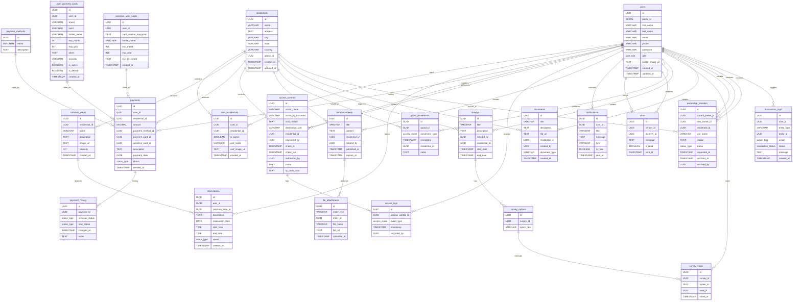

# Resicue Database
### PostgreSQL

```mermaid

erDiagram

users {
  UUID id
  SERIAL public_id
  VARCHAR first_name
  VARCHAR last_name
  VARCHAR email
  VARCHAR phone
  VARCHAR password
  user_role role
  TEXT profile_image_url
  TIMESTAMP created_at
  TIMESTAMP updated_at
}

residentials {
  UUID id
  VARCHAR name
  TEXT address
  VARCHAR city
  VARCHAR state
  VARCHAR country
  UUID admin_id
  TIMESTAMP created_at
  TIMESTAMP updated_at
}

user_residentials {
  UUID id
  UUID user_id
  UUID residential_id
  BOOLEAN is_owner
  VARCHAR unit_name
  TEXT unit_image_url
  TIMESTAMP created_at
}

common_areas {
  UUID id
  UUID residential_id
  VARCHAR name
  TEXT description
  TEXT image_url
  INT capacity
  TIMESTAMP created_at
}

reservations {
  UUID id
  UUID user_id
  UUID common_area_id
  TEXT description
  DATE reservation_date
  TIME start_time
  TIME end_time
  status_type status
  TIMESTAMP created_at
}

payment_methods {
  UUID id
  VARCHAR name
  TEXT description
}

sensitive_user_cards {
  UUID id
  UUID user_id
  TEXT card_number_encrypted
  VARCHAR holder_name
  INT exp_month
  INT exp_year
  TEXT cvv_encrypted
  TIMESTAMP created_at
}

user_payment_cards {
  UUID id
  UUID user_id
  VARCHAR brand
  VARCHAR last4
  VARCHAR holder_name
  INT exp_month
  INT exp_year
  TEXT token
  VARCHAR provider
  BOOLEAN is_active
  BOOLEAN is_default
  TIMESTAMP created_at
}

payments {
  UUID id
  UUID user_id
  UUID residential_id
  DECIMAL amount
  UUID payment_method_id
  UUID payment_card_id
  UUID sensitive_card_id
  TEXT description
  DATE payment_date
  status_type status
  TIMESTAMP created_at
}

payment_history {
  UUID id
  UUID payment_id
  status_type previous_status
  status_type new_status
  TIMESTAMP changed_at
  TEXT notes
}

access_controls {
  UUID id
  VARCHAR visitor_name
  VARCHAR visitor_id_document
  TEXT visit_reason
  VARCHAR destination_unit
  UUID residential_id
  UUID registered_by
  TIMESTAMP check_in
  TIMESTAMP check_out
  UUID authorized_by
  TEXT notes
  TEXT qr_code_data
}

access_logs {
  UUID id
  UUID access_control_id
  access_event event_type
  TIMESTAMP timestamp
  UUID recorded_by
}

announcements {
  UUID id
  VARCHAR title
  TEXT content
  UUID residential_id
  UUID created_by
  TIMESTAMP published_at
  TIMESTAMP expires_at
}

file_attachments {
  UUID id
  VARCHAR entity_type
  UUID entity_id
  VARCHAR file_name
  TEXT file_url
  TIMESTAMP uploaded_at
}

notifications {
  UUID id
  UUID user_id
  VARCHAR title
  TEXT message
  VARCHAR type
  BOOLEAN is_read
  TIMESTAMP sent_at
}

chats {
  UUID id
  UUID sender_id
  UUID receiver_id
  TEXT message
  BOOLEAN is_read
  TIMESTAMP sent_at
}

guard_movements {
  UUID id
  UUID guard_id
  access_event movement_type
  TIMESTAMP timestamp
  UUID residential_id
  TEXT notes
}

surveys {
  UUID id
  VARCHAR title
  TEXT description
  UUID created_by
  UUID residential_id
  TIMESTAMP start_date
  TIMESTAMP end_date
}

survey_options {
  UUID id
  UUID survey_id
  VARCHAR option_text
}

survey_votes {
  UUID id
  UUID survey_id
  UUID option_id
  UUID user_id
  TIMESTAMP voted_at
}

documents {
  UUID id
  VARCHAR title
  TEXT description
  TEXT file_url
  UUID residential_id
  UUID created_by
  VARCHAR document_type
  TIMESTAMP created_at
}

ownership_transfers {
  UUID id
  UUID current_owner_id
  UUID new_owner_id
  UUID residential_id
  VARCHAR unit_name
  TEXT reason
  status_type status
  TIMESTAMP requested_at
  TIMESTAMP resolved_at
  UUID resolved_by
}

transaction_logs {
  UUID id
  UUID user_id
  VARCHAR entity_type
  UUID entity_id
  action_type action
  transaction_status status
  TEXT message
  TIMESTAMP created_at
}

%% RELATIONSHIPS

users ||--o{ user_residentials : owns
residentials ||--o{ user_residentials : contains

users ||--o{ reservations : books
common_areas ||--o{ reservations : receives
residentials ||--o{ common_areas : includes

users ||--o{ payments : makes
residentials ||--o{ payments : receives
payment_methods ||--o{ payments : used_by
user_payment_cards ||--o{ payments : used_for
sensitive_user_cards ||--o{ payments : used_for
payments ||--o{ payment_history : history

residentials ||--o{ access_controls : controls
users ||--o{ access_controls : registers
users ||--o{ access_controls : authorizes
access_controls ||--o{ access_logs : logs
users ||--o{ access_logs : records

residentials ||--o{ announcements : has
users ||--o{ announcements : creates
announcements ||--o{ file_attachments : attaches

users ||--o{ notifications : receives

users ||--o{ chats : sends
users ||--o{ chats : receives

users ||--o{ guard_movements : performs
residentials ||--o{ guard_movements : hosted_at

users ||--o{ surveys : creates
residentials ||--o{ surveys : organizes
surveys ||--o{ survey_options : has
survey_options ||--o{ survey_votes : receives
users ||--o{ survey_votes : votes

users ||--o{ documents : creates
residentials ||--o{ documents : stores

users ||--o{ ownership_transfers : initiates
residentials ||--o{ ownership_transfers : occurs_in
users ||--o{ ownership_transfers : receives
users ||--o{ ownership_transfers : resolves

users ||--o{ transaction_logs : triggers
```
